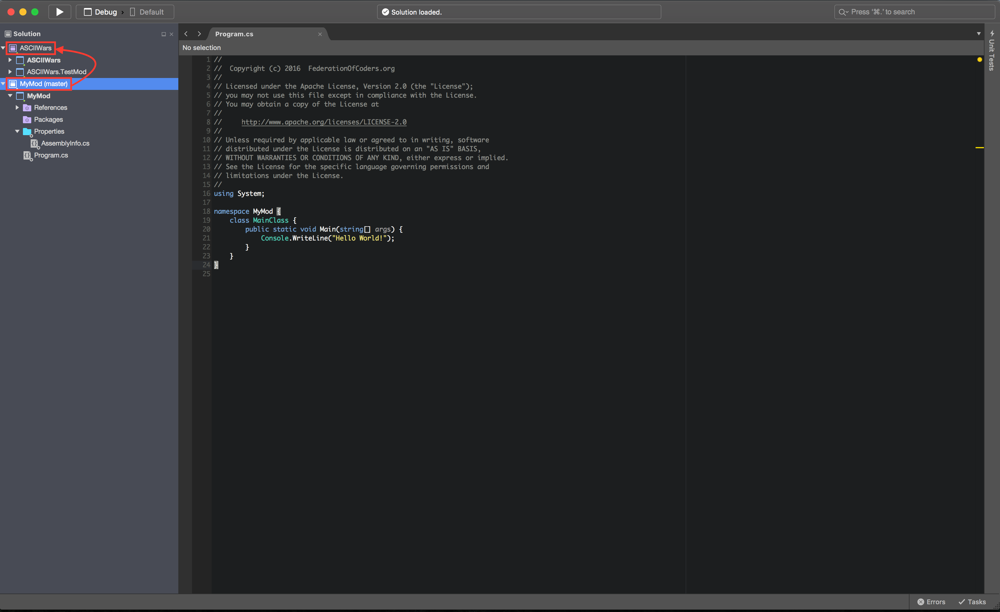
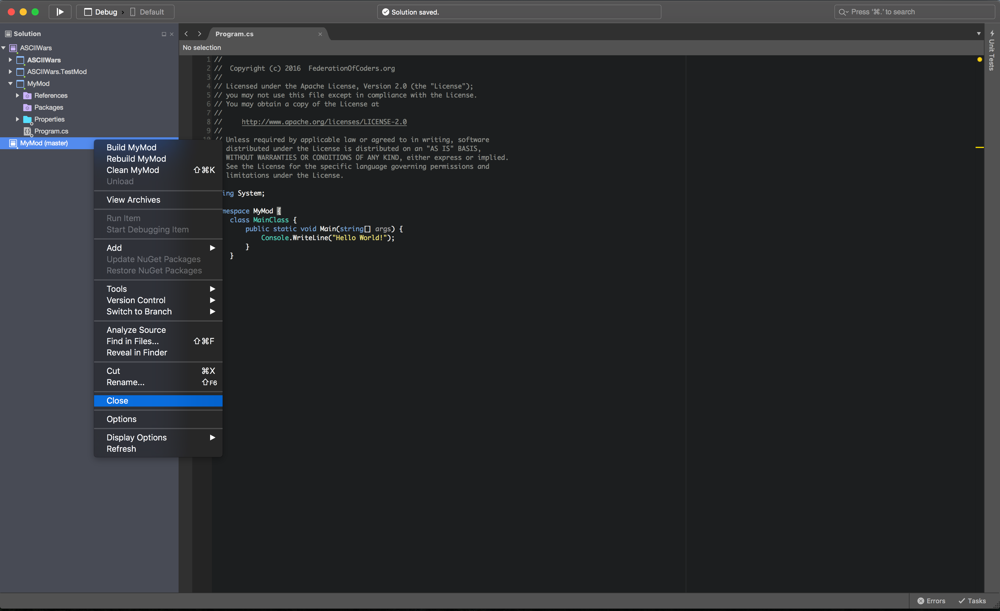
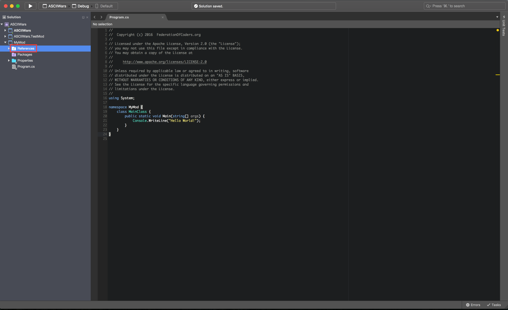
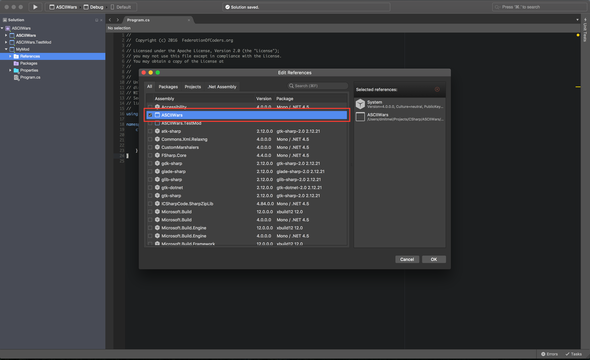

# Как создать мод
В игре есть уже встроенная поддержка моддинга. Принцип создания мода довольно
простой, о этом и пойдёт речь в этом туториале.

## Файлы
В представлении файловой системы моды размещаются так:
```
ASCIIWars.exe
...
mods/
    MyMod/
        MyMod.dll   <--- Код мода в виде динамической библиотеки
        assets/     <--- Ассеты мода, могут отсутствовать
        mod.json    <--- Файл с данными мода
```

## Создание проекта
1. Для начала, создаём проект с типом "Библиотека".
2. Добавляем в зависимости решение `ASCIIWars`. Не знаю как, но это обязательно надо сделать.
   Хотя, есть один способ:
   1. Получаем [исходники с Github'а](https://github.com/fed-of-coders/ASCIIWars):

      ```sh
      git clone https://github.com/fed-of-coders/ASCIIWars.git
      cd ASCIIWars
      ```

  2. Создаём проект в папке `Src`.
  3. Открываем из этого проекта решение `ASCIIWars`, так чтобы не закрыть этот проект:
     
  3. Перетаскиваем проект из этого решения в решение `ASCIIWars`:
     
  4. Закрываем решение мода:
     
  5. Дважды кликаем по папке `References`, чтобы открыть окно зависимостей проекта мода:
     
  6. Выбираем проект `ASCIIWars` как зависимость (может потребоваться закрытие решения и
     открытия решения `ASCIIWars`!):
     

  Отлично! теперб можно использовать классы из namespace'а `ASCIIWars`!

## Код
Теперь нужно скопировать и вставить вот этот код в главный файл с кодом:
```csharp
using ASCIIWars.Modding;

namespace MyMod {
    public class MyMod : ModDescriptor {
        public MyMod(ModInfo modInfo) : base(modInfo) { }

        public override void OnLoadBy(ModLoader modLoader) {

        }

        public override void OnDestroyBy(ModLoader modLoader) {

        }
    }
}
```

Этот класс теперь будет отвечать за основные события жизни мода: загрузка (метод `OnLoadBy`)
и разрушение (метод `OnDestroyBy`). Дальше я буду называеть его "Дескриптором мода".

Класс `ModInfo` хранит эту информацию о моде:
- Название (`ModInfo.name`)
- Описание (`ModInfo.description`)
- ID (`ModInfo.id`)
- Версию мода (`ModInfo.version`)
- Полное имя дескриптора мода (`ModInfo.descriptorClass`)
- Имя `.dll` файла с кодом мода (`ModInfo.dllName`)
- URL проекта (`ModInfo.projectURL`)
- Папка с модом (`ModInfo.modDirectory`)

Вся информация о моде (кроме папки с модом) загружается из файла `mod.json`. Он выглядит
примерно так:
```json
{
    "name": "Мой Мод",
    "id": "MyMod",
    "description": "Просто мод для изучения концепций моддинга.",
    "modVersion": "1.0.0",
    "descriptorClass": "MyMod.MyMod",
    "dllName": "MyMod.dll",
    "projectURL": "http://example.com/"
}
```

### Ассеты
В классе `ModDescriptor` есть поле `assets`, которое при первом обращении к нёму подгрузит
ассеты мода.

### Добавление кампаний
Тут всё очень просто. Надо выполнить этот код в методе `OnLoadBy`
```csharp
Campaign campaign = Campaign.LoadFrom(assets, "your-campaign");
Application.Campaigns.Add(campaign);
```

## Сборка мода
После сборки мода надо просто скопировать файлы `MyMod.dll`, `mod.json` и папку с а
ссетами (`assets`) в файлы игры по пути `mods/MyMod/`. Естественно, надо заменить
`MyMod` на название вашего мода.
